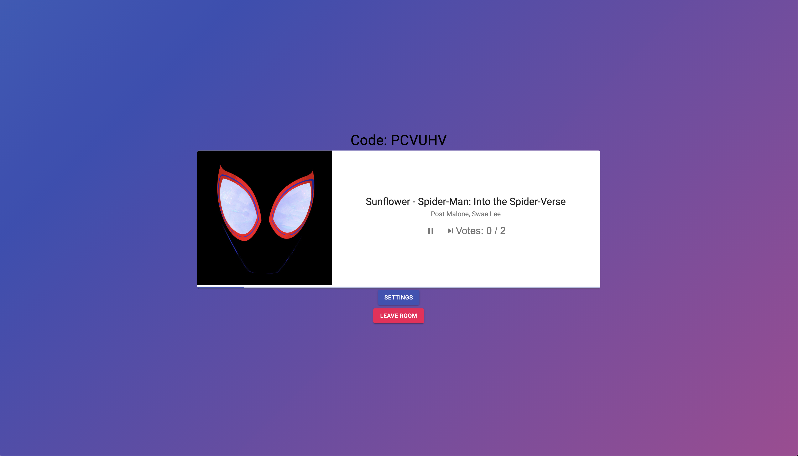

# Enmusique
Project Name: Enmusique  
Project Date: January 2021  
Technologies Used: React[Javascript], Django[Python] 
Project Description:
Full stack web application designed to play music on Spotify collaboratively by allowing users to create listening rooms, where other users can then join seamlessly.

## Features

* Open Source
* Users can create & join listening rooms
* Users can play/pause songs in listening rooms
* Users can vote to skip songs
* Spotify Authentication

## Table of Contents
1. [ScreenShots](#screenshots)
2. [Installation](#installation)

## Screenshots

## Installation

## Suggestions
Open to any suggestions and help provided.
